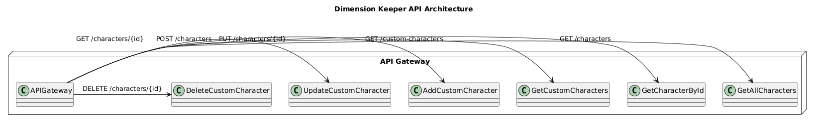
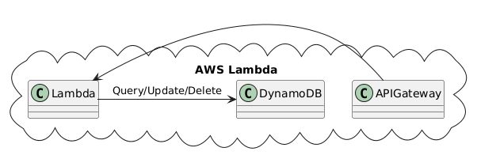
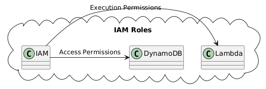
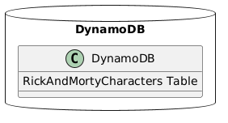

# Dimension Keeper API

A serverless backend application for managing custom Rick and Morty characters. This project uses **AWS Lambda**, **API Gateway**, **DynamoDB**, and is deployed using **AWS CloudFormation**.

Summary:




---

## Features

- Fetch all characters from the Rick and Morty database.
- Retrieve a character by its ID.
- Add custom characters.
- Update custom character details.
- Delete custom characters.

---

## Project Structure

```plaintext
.
├── functions/
│   ├── addCustomCharacter.js       # Add custom character Lambda function
│   ├── deleteCustomCharacter.js    # Delete custom character Lambda function
│   ├── getAllCharacters.js         # Fetch all characters Lambda function
│   ├── getCharacterById.js         # Fetch character by ID Lambda function
│   ├── getCustomCharacters.js      # Fetch all custom characters Lambda function
│   └── updateCustomCharacter.js    # Update custom character Lambda function
├── package-lock.json               # Lockfile for Node.js dependencies
├── package.json                    # Node.js package dependencies
└── templates/
    └── rick_and_morty_stack.yml    # AWS CloudFormation template
```
# Deployment Guide Using CloudFormation Template
This section provides a step-by-step guide to deploying the Rick and Morty API application using the provided AWS CloudFormation YAML template.
Prerequisites

1.	AWS Account:
Ensure you have an active AWS account with access to IAM, Lambda, DynamoDB, and API Gateway.
2.	AWS CLI:
Install and configure the AWS CLI.

Provide your AWS Access Key, Secret Key, and default region during configuration.

3.	Template File:
Ensure you have the rick_and_morty_stack.yml file from the templates directory in your project.
4.	S3 Bucket:
For Lambda code deployment, upload the functions directory to an S3 bucket. Make note of the S3 bucket name and paths for use as parameters during deployment.

Steps for Deployment

1.	Upload Lambda Code to S3:
Use the AWS CLI to upload the Lambda functions to an S3 bucket:

2.	Create the Stack:
Deploy the stack using the CloudFormation template:
      aws cloudformation create-stack \
      --stack-name RickAndMortyStack \
      --template-body file://templates/rick_and_morty_stack.yml \
      --parameters ParameterKey=BucketName,ParameterValue=<your-s3-bucket-name> \
      ParameterKey=CodePrefix,ParameterValue=functions/ \
      ParameterKey=TableName,ParameterValue=RickAndMortyCharacters \
      --capabilities CAPABILITY_NAMED_IAM
3. Wait for Stack Creation:
   Monitor the stack creation process:
aws cloudformation describe-stacks --stack-name RickAndMortyStack
Once the StackStatus shows CREATE_COMPLETE, the deployment is successful.
4.	Validate the Deployment:
      •	Go to the AWS Management Console.
      •	Navigate to API Gateway and confirm the API endpoints were created.
      •	Navigate to Lambda and verify all functions are present and linked to the API Gateway.
      •	Check the DynamoDB table RickAndMortyCharacters was created.

Parameters in the YAML Template

The CloudFormation template (rick_and_morty_stack.yml) includes the following configurable parameters:


# Manual deployment
## Prerequisites

1. Node.js: Ensure Node.js and npm are installed.
2. AWS CLI: Install and configure the AWS CLI.

```
aws configure
```
3. IAM Permissions: Your AWS user must have:
- Lambda Management
- API Gateway Management
- DynamoDB Management
- CloudFormation Management

4. S3 Bucket: Create an S3 bucket for storing Lambda deployment packages.

## Setup and Deployment

### Step 1: Install Dependencies

Before deploying the stack, ensure you have installed all necessary dependencies for the Lambda functions. Run the following command in the root directory:

```bash
npm install
```
### Step 2: Package Lambda Functions
Each Lambda function in the functions/ directory needs to be zipped for deployment. For example, to package the addCustomCharacter.js function:
```bash
zip addCustomCharacter.zip functions/addCustomCharacter.js
```
Repeat this process for all the files in the functions/ directory.

### Step 3: Prepare CloudFormation Template

Ensure that the CloudFormation template located in templates/rick_and_morty_stack.yml is correctly configured. The template defines the following resources:
- API Gateway: Serves as the public-facing entry point to the Lambda functions.
- IAM Roles: Grants the necessary permissions for Lambda to interact with DynamoDB and API Gateway.
- DynamoDB Tables: Stores the character data for the application.
- Lambda Functions: Backend logic for handling API requests.

### Step 4: Deploy CloudFormation Stack

Use the AWS CLI to deploy the CloudFormation stack. Run the following command, replacing YOUR_STACK_NAME with the desired name for your stack:
```bash
aws cloudformation deploy \
--template-file templates/rick_and_morty_stack.yml \
--stack-name YOUR_STACK_NAME \
--capabilities CAPABILITY_NAMED_IAM
```

#### Parameters

Ensure you provide the correct parameters when deploying:
•	DynamoDB Table Name: Name of the DynamoDB table to be created.
•	API Gateway Name: Name of the API Gateway to be set up.

### Step 5: Verify Deployment

1.	Go to the AWS Management Console and navigate to the CloudFormation section.
2.	Check the status of your stack. Once it shows CREATE_COMPLETE, the deployment is successful.
3.	Navigate to the API Gateway section to verify that the endpoints have been created.
4.	Test the API endpoints using tools like Postman or curl.

## Additional Notes

- Ensure your AWS credentials are properly configured in your local environment.
- Use proper IAM policies to secure the Lambda functions and API Gateway endpoints.
- Monitor your resources using AWS CloudWatch for logs and performance metrics.